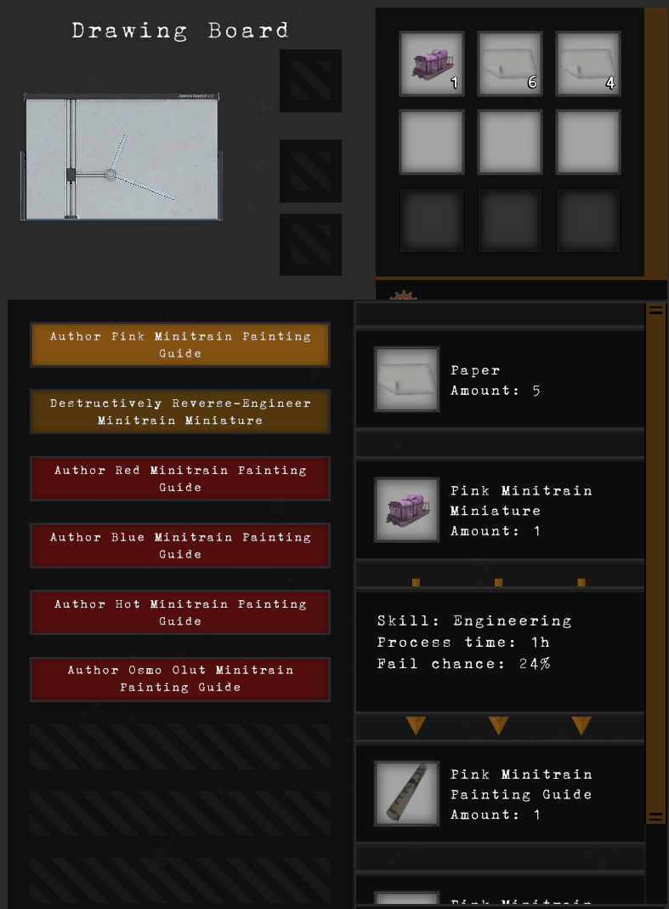
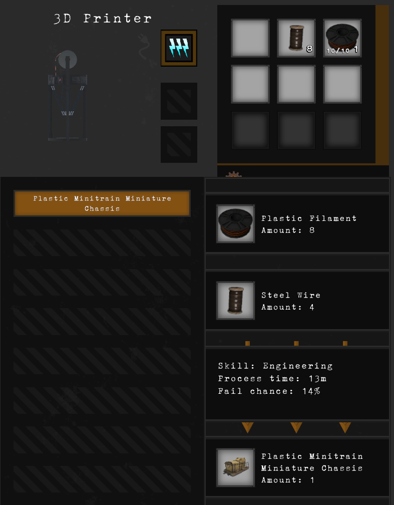
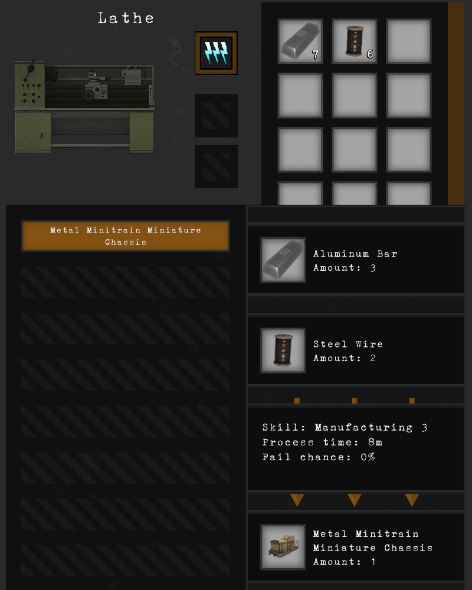
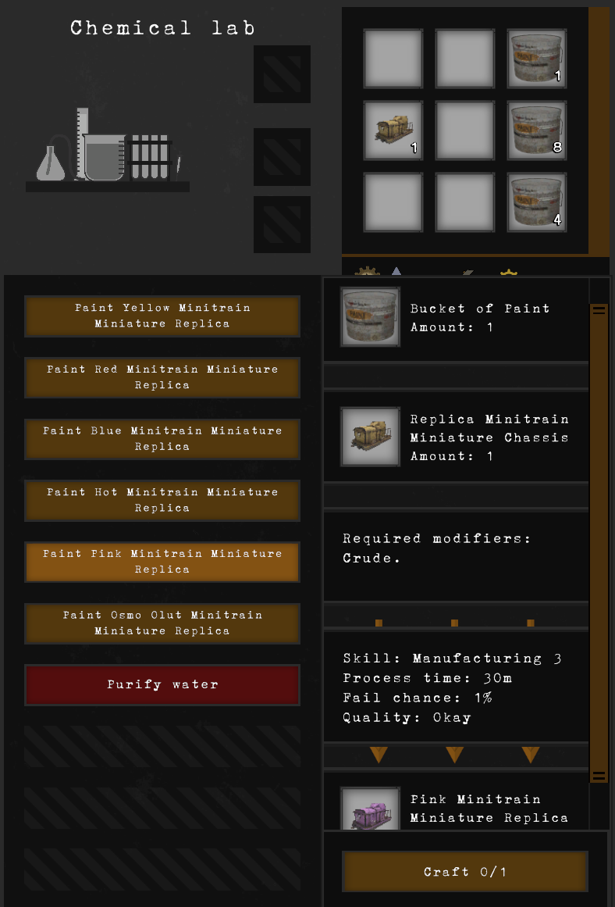
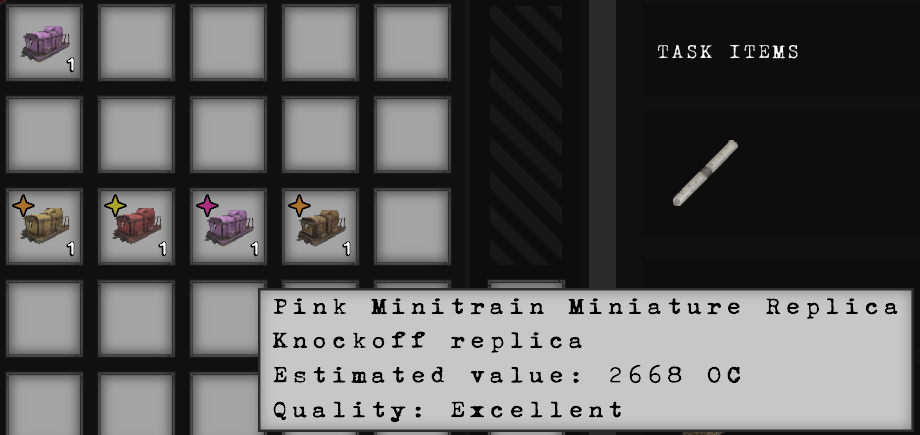
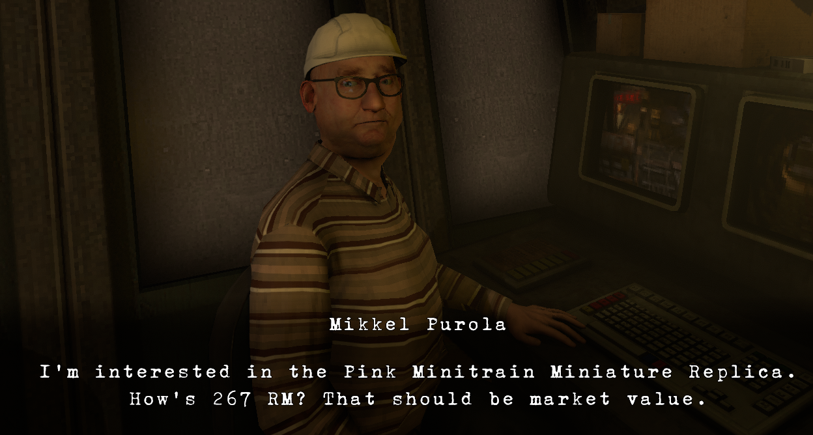

# MinitrainHobbyist

More fun with Minitrains!

## V1.0.0 Features:
Craft your own minitrain miniatures:
* Examine the existing minitrain models at the Drawing Desk to learn how to create your own replicas.  Learning to paint a minitrain variant does not destroy the original, but learning to make the chassis, well... you're going to have to take it apart and there's no chance of putting it back together again afterwards.
* Craft replica chassis on the cheap with a 3D printer, or with some quality using industrial machining equipment.
* Paint the replica chassis at your Chemical Lab.  Replica models have a quality affected by your skill level.

Keep that Osmo Olut Minitrain Miniature original for yourself:
* Mikkel down in the mines is a bit of a model train connoisseur and can identify a badly crafted replica.  But with a very well crafted replica, you might be able to trick him into accepting a replica Osmo Olut Minitrain Miniature instead of the original printing.
Or maybe sell it and some of your excess models for a profit:
* Additionally after completing Mikkel's objective, he is now willing to buy models for RM.

Known limitations of this version:
* Mikkel has no cooldown timer on his minitrain purchasing (ideally he would buy one a day)
* "Unpainted" chassis are using the yellow icon/model (I promise I'll get around to getting proper icons/textures at some point)

Dependencies:
* Requires Lavender v6.0.1 or later.  See https://github.com/leonarudo/Lavender

# Recipes:
**First, learn about the authentic minitrains at the drawing board:**

  

**After committing that knowledge to memory (by reading the created item), it's time to make some replica chassis:**
 
  

**Now it's time to paint the chassis.  Your skill and which chassis you use will impact the eventual quality of the replica:**

  

**Replicas look the same when placed in the world.  Most models found in Obenseuer have been "naturally weathered" through improper care.  Freshly crafted high quality replicas are worth even MORE than the authentic models they are based on.  Sell your creations to Mikkel for a nice profit**

